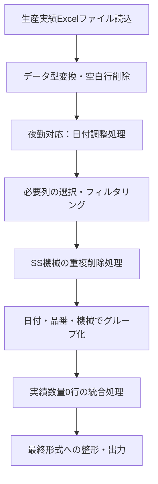

# M言語クエリ「クエリ成形改訂」詳細解説

## 1. 概要

本クエリは、生産管理システムから出力される月次実績データを、日別・品番別・機械別の集計データに変換するPower Queryスクリプトです。夜勤シフト対応、SS機械の重複処理、実績数量0件の特殊処理など、製造現場の実運用に即した処理を実装しています。

## 2. 業務フロー

### 全体の処理フロー



### 処理の目的

1. **データクレンジング**: 不要データの除去と形式統一
2. **夜勤対応**: 深夜～早朝（0-8時）の実績を前日扱いに変換
3. **重複排除**: SS機械（SS01-05）の重複データを削除
4. **集計処理**: 日付・品番・機械単位での実績集計
5. **不良情報統合**: 実績0件の不良情報を他の実績行に統合

## 3. 主要処理の詳細解説

### 3.1 データ読込と初期処理（行1-6）

```m
ソース = Excel.Workbook(File.Contents("Z:\全社共有\生産管理課\生産実績データ\2506.xlsx"), null, true),
Sheet1_Sheet = ソース{[Item="Sheet1",Kind="Sheet"]}[Data],
昇格されたヘッダー数 = Table.PromoteHeaders(Sheet1_Sheet, [PromoteAllScalars=true]),
変更された型 = Table.TransformColumnTypes(昇格されたヘッダー数,{...}),
削除された空白行 = Table.SelectRows(変更された型, each not List.IsEmpty(List.RemoveMatchingItems(Record.FieldValues(_), {"", null})))
```

**解説**:
- 共有フォルダから月次実績ファイル（例：2506.xlsx = 2025年6月）を読込
- 1行目をヘッダーに昇格し、各列のデータ型を適切に設定
- 全列が空白またはnullの行を削除（不要な空行の除去）

### 3.2 夜勤対応の日付調整（行8-19）

```m
日付列追加 = Table.AddColumn(削除された空白行, "日付", each
    let
        dateTimeValue = try DateTime.From([時刻]) otherwise null,
        作業日の日付 = [作業日],
        時刻部分 = if dateTimeValue <> null then DateTime.Time(dateTimeValue) else null
    in
    // 時刻部分が取得でき、かつ0時より大きく8時以下の場合
    if 時刻部分 <> null and 時刻部分 > #time(0, 0, 0) and 時刻部分 <= #time(8, 0, 0) then
        Date.AddDays(作業日の日付, -1)
    else
        作業日の日付,
type date)
```

**解説**:
- 夜勤シフトの実績を正しい日付に振り分ける処理
- 0時より後、8時以前の作業は前日の実績として扱う
- 例：6月2日 AM2:00の実績 → 6月1日の実績として集計

### 3.3 SS機械の重複削除処理（行24-40）

```m
重複削除済み行 = let
    SS行 = Table.SelectRows(フィルターされた行, each ([機械コード] = "SS01" or ... or [機械コード] = "SS05")),
    非SS行 = Table.SelectRows(フィルターされた行, each ([機械コード] <> "SS01" and ... and [機械コード] <> "SS05")),
    
    重複削除済みSS行 = Table.FromRecords(
        List.Combine(
            List.Transform(
                Table.Group(SS行, {"実績数量", "時刻"}, {{"Rows", each _, type table}})[Rows],
                each Table.ToRecords(Table.FirstN(Table.Sort(_, {{"品番・図番", Order.Ascending}}), 1))
            )
        )
    ),
    
    結合結果 = Table.Combine({非SS行, 重複削除済みSS行})
in
    結合結果
```

**解説**:
- SS機械（SS01～SS05）は同一実績が複数記録される特性がある
- 実績数量と時刻が同じ場合、品番順で最初の1件のみを採用
- 非SS機械のデータはそのまま保持

### 3.4 統合グループ化処理（行42-71）

```m
統合グループ化 = Table.Group(重複削除済み行, {"日付", "品番・図番", "機械コード"}, {
    {"実績数量", each List.Sum([実績数量]), type nullable number},
    {"不良数量", each List.Sum([不良数量]), type nullable number},
    // 段取時間：作業区分が「段取完了」の加工時間の合計を分で計算
    {"段取時間", each 
        let
            段取時間計算値 = List.Sum(List.Transform(Table.SelectRows(_, each [作業区分] = "段取完了")[加工時間], each _ / 60))
        in
            if 段取時間計算値 = null then 0 else 段取時間計算値, 
        type nullable number},
    // 稼働時間：作業区分が「加工完了」の加工時間の合計を分で計算
    {"稼働時間", each List.Sum(List.Transform(Table.SelectRows(_, each [作業区分] = "加工完了")[加工時間], each _ / 60)), type nullable number},
    // 不良区分の統合
    {"不良区分", each ... , type nullable text}
})
```

**解説**:
- 日付・品番・機械コードでグループ化し、各種数値を集計
- 段取時間：段取作業の時間を秒から分に変換して合計
- 稼働時間：実際の加工作業時間を秒から分に変換して合計
- 不良区分：「不良名称+数量」形式で文字列結合（例："キズ3,打痕1"）

### 3.5 実績数量0行の統合処理（行73-115）

```m
処理済みグループ = Table.Group(統合グループ化, {"品番・図番", "機械コード"}, {
    {"ProcessedData", (currentGroupTable as table) =>
        let
            zero実績行 = Table.SelectRows(currentGroupTable, each [実績数量] = 0),
            nonZero実績行 = Table.SelectRows(currentGroupTable, each [実績数量] <> 0),
            // 実績0行がある場合、その不良情報を実績最大行に統合
            ...
        in
            resultTable, type table}
})
```

**解説**:
- 実績数量0の行は単独では意味を持たないため、同一品番・機械の他の行に統合
- 統合先は実績数量が最大の行（複数ある場合は最初に出現した行）
- 不良数量は加算、不良区分は文字列として結合

## 4. 技術的なポイント

### 4.1 エラーハンドリング

```m
dateTimeValue = try DateTime.From([時刻]) otherwise null
```
- `try...otherwise`構文で時刻変換エラーを適切に処理
- 不正な時刻データがあってもクエリ全体が停止しない

### 4.2 効率的なグループ化

- 1回目と2回目のグループ化を統合し、処理を最適化
- Table.Group内で複数の集計を同時実行

### 4.3 動的な列処理

```m
columnsInProcessedData = Table.ColumnNames(統合グループ化),
columnsToExpand = List.RemoveItems(columnsInProcessedData, groupingKeysOf処理済みグループ)
```
- 列名を動的に取得し、グループ化キー以外の列を自動的に展開
- スキーマ変更に対する柔軟性を確保

### 4.4 null値の適切な処理

- 段取時間がnullの場合は0として扱う
- 不良区分の空文字・null値は除外してから結合

## 5. 後続処理との連携

### 5.1 出力データ形式

最終的な出力テーブルの列構成：

| 列名 | 説明 | データ型 | 備考 |
|------|------|----------|------|
| 日付 | 集計日付 | Date | 夜勤調整済み |
| 品番 | 製品番号 | Text | 元：品番・図番 |
| 機械 | 機械コード | Text | 元：機械コード |
| 実績 | 実績数量合計 | Number | 元：実績数量 |
| 不良 | 不良数量合計 | Number | 元：不良数量 |
| 稼働時間 | 加工時間（分） | Number | 分単位 |
| 段取時間 | 段取時間（分） | Number | 分単位 |
| 不良区分 | 不良内訳 | Text | カンマ区切り |

### 5.2 Excelマクロとの連携

このクエリの出力は、以下のExcelマクロで利用されます：

1. **日別集計マクロ群**
   - `m日別集計_加工品番別.bas`：品番別の日次集計
   - `m日別集計_成形号機別.bas`：機械別の日次集計

2. **転記マクロ群**
   - 各種転記マクロがこのデータを元に集計表へ転記
   - 不良区分の文字列は解析されて個別集計される

### 5.3 データ更新フロー

1. 月次で生産実績ファイルを指定フォルダに配置
2. Power Queryの「更新」ボタンでデータ取込
3. 各種集計マクロを実行して日別データ作成
4. 転記マクロで最終的な集計表に反映

### 5.4 注意事項

- **ファイルパス**: ハードコーディングされているため、環境に応じて修正が必要
- **処理時間**: 大量データの場合、実績0行の統合処理に時間がかかる可能性
- **メモリ使用**: グループ化処理が多いため、大規模データではメモリ使用量に注意

---

*本解説は2025年6月時点の「クエリ成形改訂.txt」に基づいています。*